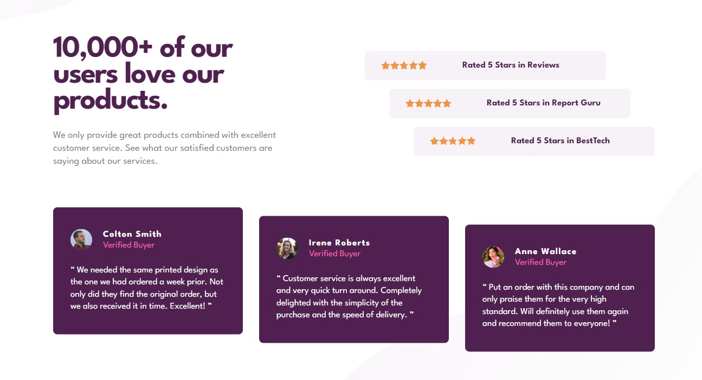

# Frontend Mentor - Social proof section solution

This is a solution to the [Social proof section challenge on Frontend Mentor](https://www.frontendmentor.io/challenges/social-proof-section-6e0qTv_bA). Frontend Mentor challenges help you improve your coding skills by building realistic projects.

## Table of contents

- [Overview](#overview)
  - [The challenge](#the-challenge)
  - [Screenshot](#screenshot)
  - [Links](#links)
- [My process](#my-process)
  - [Built with](#built-with)
  - [What I learned](#what-i-learned)
  - [Continued development](#continued-development)
- [Author](#author)

## Overview

### The challenge

Users should be able to:

- View the optimal layout for the section depending on their device's screen size

### Screenshot

### Links

- Solution URL: [https://github.com/wavegate/social-proof-section-master](https://github.com/wavegate/social-proof-section-master)
- Live Site URL: [https://moonlit-boba-ff0035.netlify.app/](https://moonlit-boba-ff0035.netlify.app/)

## My process

### Built with

- Semantic HTML5 markup
- CSS custom properties
- Flexbox

### What I learned

- I learned that setting the height of the body to 100% sets its height to HTML, which takes its height from the viewport.
- I practiced using multiple backgrounds on a single element, and using pseudoelements to place images.

### Continued development

- I'm not sure if Flexbox is the best way to do all these layouts but it seems to work fine for me for now. I'm starting to get a lot of divs in my HTML, so I'm concerned things will start to get out of hand once I add more and more complicated layouts.
- I wasn't able to figure out how to space out the stars while drawing them out with pseudoelements.
- I had some trouble getting the background images to work properly, and was getting quite confused setting the height of the body from viewheight to auto and back and forth. I wasn't sure how the background positioning was working.

## Author

- Website - [wavegate](https://github.com/wavegate)
- Frontend Mentor - [@wavegate](https://www.frontendmentor.io/profile/wavegate)
